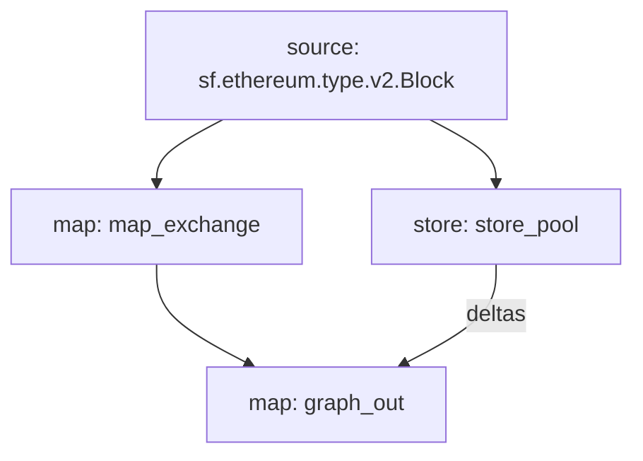

# sBTC swap pool Substreams

Even if this SPS is configured for the sBTC swap pool, you use for each pool by updating the `CONTRACT_ADDRESS`, `START_BLOCK` and the contract metadata in the `store_token` function to match your token.

## Requirements

Make sure you have the latest versions of the following installed:

- [Rust](https://rustup.rs/)
- [Make](https://formulae.brew.sh/formula/make)
- [graph-cli](https://thegraph.com/docs/en/cookbook/quick-start/#2-install-the-graph-cli)
- [substreams-cli](https://substreams.streamingfast.io/getting-started/installing-the-cli)

### 1. Update the `CONTRACT_ADDRESS` & `START_BLOCK` variables in `src/utils/constants.rs`

```rust
pub const CONTRACT_ADDRESS: &str = "0x7fC77b5c7614E1533320Ea6DDc2Eb61fa00A9714";
pub const START_BLOCK: u64 = 10276641;
```

### 2. Update the contract metadata in the `store_token` handler function

```rust
#[substreams::handlers::store]
fn store_pool(block: eth::Block, o: StoreSetProto<StableSwap::Pool>) {
    if block.number == START_BLOCK {
        let pool = &StableSwap::Pool {
            name: "sBTC Swap".to_string(),
            pool_address: "0x7fC77b5c7614E1533320Ea6DDc2Eb61fa00A9714".to_string(),
            address_token_one: "0xEB4C2781e4ebA804CE9a9803C67d0893436bB27D".to_string(),
            address_token_two: "0x2260FAC5E5542a773Aa44fBCfeDf7C193bc2C599".to_string(),
            address_token_three: "0xfE18be6b3Bd88A2D2A7f928d00292E7a9963CfC6".to_string(),
        };
        o.set(0, format!("Pool: {}", pool.pool_address), &pool);
    };
}
```

### 3. Update the initialBlock params for all modules within `substreams.yaml` file

```yaml
    initialBlock: 10276641
```

If you want to tracks all the exchanges that occured in your pool, you can choose the initialBlock as the block number of the pool contract deployment.

### 4. Compile the Project with `make build`

We now need to recompile our WASM binary with the new changes we made to the rust files.

### 5. Pack the spkg with `make pack`

We need to bundle the protobuf definitions and the WASM binary into a single file. This is what we will deploy the subgraph.

### 6. Run the substreams GUI with `make run`

We can easily run the substreams GUI to navigate through the substreams modules contents..

### 7. Deploy the subgraph with `yarn deploy`

Modify the package.json to point to your subgraph.
The deploy script will change if you are deploying to the hosted service or decentralized network, but replace this with the command that is appropriate for your setup.

### Data Flow

